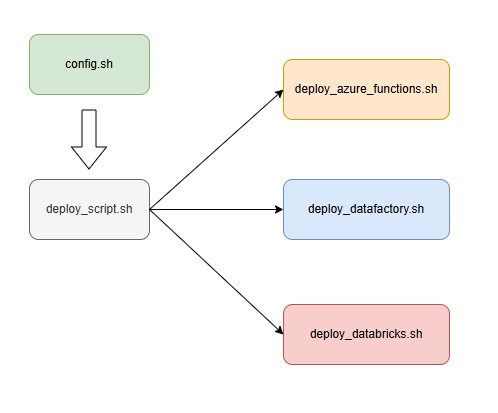

# Case Data Master - Corretora de Valores

## Objetivo

Execução de um projeto de Lakehouse para uma corretora de valores ficticia, realizando a ingestão de dados da bolsa de valores juntamente com uma base de clientes e suas transações realizadas no pregão.  

Este case foi utilizado no processo de obtenção da badge 'Data Master' na [F1rst Tecnologia](https://www.f1rst.com.br/first/#/) uma empresa do grupo [Santander](https://www.santander.com.br/).

## Descrição

O projeto visa demonstrar a ingestão de dados das seguintes fontes: 

- REST API: Informações sobre a cotação de papéis da bolsa de valores

- Banco de dados relacional: Base de clientes

- Mensageria: Logs de transações de compra e venda de papéis da bolsa pelos clientes

- Arquivo: Base de CEPs para compor informações cadastrais dos clientes
 

Os dados ingeridos serão disponibilizados no lake através da arquitetura medalhão onde cada uma de suas camadas apresentará as seguintes características: 
 
- Camada Raw: dados brutos e não tratados onde pousarão os dados provenientes das fontes de ingestão

- Camada Bronze: dados ainda no formato bruto, porém estruturados e com caráter histórico.  

- Camada Silver: dados deduplicados, filtrados e tipados, nessa camada também serão aplicadas as regras de qualidade além de tratamento dos campos sensíveis

- Camada Gold: dados agregados formando a composição da situação de cada cliente e sua posição de papéis na bolsa de valores assim como informações cadastrais, as alterações nos dados dessa camada também serão registradas através da geração de tabelas históricas  

Uma camada extra foi definida e chamada de 'mngt' a qual armazenará informações de controle de todo o processo no lake assim como dados cadastrais de governança. 

Além dos processos para movimentação dos dados entre as camadas definidas, foram criados processos para realizar o monitoramento do pipeline. 

## Pré-requisitos

O projeto utiliza recursos disponibilizados pelo provedor de nuvem Microsoft Azure, portanto para a sua implementação serão necessários os seguintes itens:

- [PYTHON 3.11](https://www.python.org/downloads/release/python-3110/)
- [AZURE CLI](https://learn.microsoft.com/en-us/cli/azure/install-azure-cli-windows?pivots=winget)
- [AZURE FUNCTIONS CORE TOOLS](https://learn.microsoft.com/en-us/azure/azure-functions/functions-run-local?tabs=windows%2Cisolated-process%2Cnode-v4%2Cpython-v2%2Chttp-trigger%2Ccontainer-apps&pivots=programming-language-python#install-the-azure-functions-core-tools)
- [DATABRICKS CLI](https://docs.databricks.com/en/dev-tools/cli/install.html#source-install)
- Interpretador Bash (sugestão para ambientes Windows [Git Bash](https://git-scm.com/downloads/win))

Azure account

É necessário possuir uma Azure account com subscrição ativa nas modalidades 'Free Tier' ou 'Pay as you go'. 
Ver: [Azure account](https://azure.microsoft.com/en-us/pricing/purchase-options/azure-account)

Os seguintes recursos são provisionados para execução do case:
- Storage Account
- Data Factory
- Function App
- Event Hubs
- SQL Server
- Key Vault
- Databricks

## Configuração

### Login Azure account

No prompt Bash, no diretório raiz do projeto, faça o login na sua Azure account através do comando abaixo, quando solicitado selecione a subscription desejada.

    az login --tenant "<TENANT_ID>"

Obtenha o <TENANT_ID> através do [portal Azure](https://portal.azure.com/#home) -> Tenant Properties

### Estrutura dos scripts de deploy

Os scripts de deploy apresentam a estrutura mostrada abaixo, onde os principais recursos possuem scripts de deploy separados para melhor organização, porém todos são invocados a partir do script principal 'deploy_script.sh' sem necessidade de que sejam invocados separadamente.

### Script de configuração

Edite o arquivo 'config.sh' com os parâmetros necessários para o deploy. 

O arquivo possui comentários para guiar no preenchimento de cada parâmetro.

## Execução do deploy

Uma vez definidos os parâmetros no arquivo 'config.sh', execute o script de deploy.

O comando abaixo inicia a execução do deploy na Azure dos recursos necessários para o case.

    ./deploy_script.sh > deploy_output.log 2>&1

No comando acima toda a saída do script de deploy é redirecionada para o arquivo 'deploy_output.log' no diretório raiz do projeto caso deseje consultá-lo após o fim do deploy ou para debug de erros.

## Melhorias desejadas

- Deploy de recursos azure utilizando ARM templates
- Utilização de service principal para execução de jobs Databricks
- Substituir uso do comando grep pelo programa linux 'jq' no tratamento de retornos json nos scripts de implantação
- Substituir uso do Databricks CLI pela API Rest
- Substituir uso de Capture nos event hubs por job databricks lendo diretamente o tópico de ingestão dos status das ordens de compra e venda do cliente
  o Capture é responsável pelo maior custo no namespace
- Usar variáveis globais no data factory e definir seus valores usando azure cli, substituir pelo processo atual que usa awk e json templates para definir parâmetros para os elementos adf.
