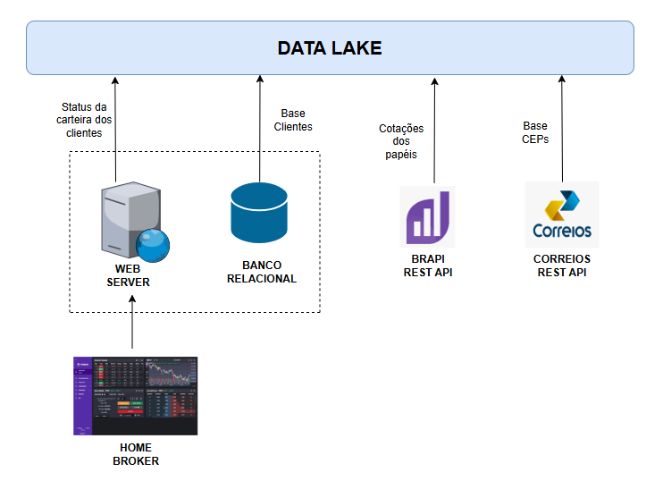
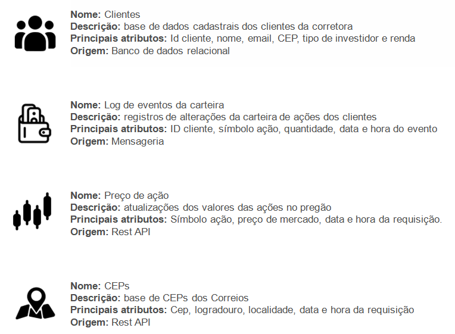
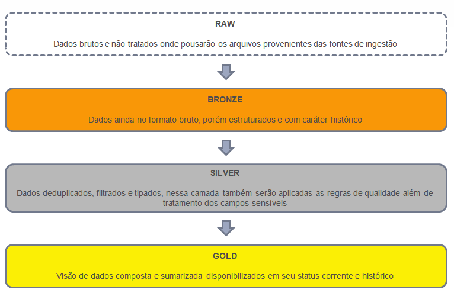
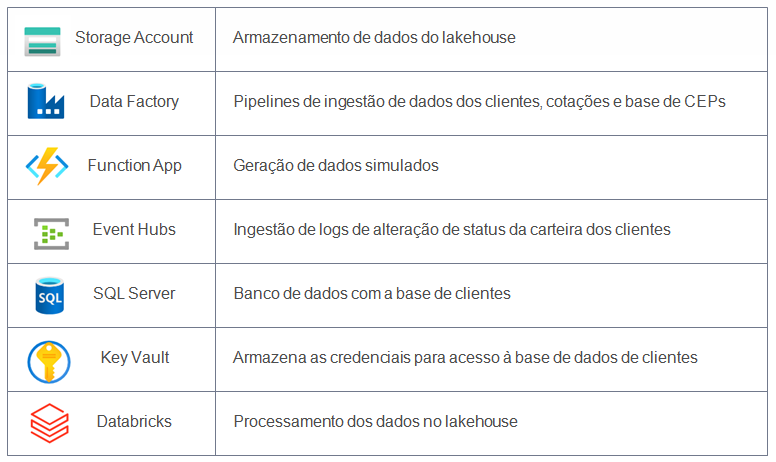

# Case Data Master - Corretora de Valores

## 1. Objetivo

Execução de um projeto de Lakehouse para uma corretora de valores fictícia, realizando a ingestão de dados da bolsa de valores juntamente com uma base de clientes e as atualizações de sua carteira de ações.  

Este case foi utilizado no processo de obtenção da badge 'Data Master' na [F1rst Tecnologia](https://www.f1rst.com.br/first/#/) uma empresa do grupo [Santander](https://www.santander.com.br/).

## 2. Descrição resumida

O case se baseou no desafio de criar um projeto de Lakehouse completo, passando pela ingestão, processamento e monitoramento.

A demanda é a representada pelo diagrama abaixo:

O projeto visa demonstrar a ingestão de dados das seguintes fontes: 

- Banco de dados relacional: Base cadastral de clientes da corretora

- Mensageria: Logs de atualização da carteira de ações dos clientes oriundos dos sistemas da corretora

- REST API: Informações sobre a cotação de papéis da bolsa de valores e base de CEPs dos correios para enriquecimento de informações cadastrais
 

Os dados ingeridos serão disponibilizados no lake através da arquitetura medalhão onde cada uma de suas camadas apresentará as seguintes características: 
 
- Camada Raw: dados brutos e não tratados onde pousarão os dados provenientes das fontes de ingestão

- Camada Bronze: dados ainda no formato bruto, porém estruturados e com caráter histórico.  

- Camada Silver: dados deduplicados, filtrados e tipados, nessa camada também serão aplicadas as regras de qualidade além de tratamento dos campos sensíveis

- Camada Gold: dados agregados formando a composição da situação de cada cliente e sua posição de papéis na bolsa de valores assim como informações cadastrais, as alterações nos dados dessa camada também serão registradas através da geração de tabelas históricas  

Uma camada extra foi definida e chamada de 'mngt' a qual armazenará informações de controle de todo o processo no lake assim como dados cadastrais de governança. 

Além dos processos para movimentação dos dados entre as camadas definidas, foram criados processos para realizar o monitoramento do pipeline. 

### Fontes de dados

Abaixo segue detalhamento dos dados usados no case.

### Arquitetura de dados

Os dados ingeridos são organizados no lakehouse através da arquitetura medalhão, cada camada apresentando as seguintes características:

## 3. A arquitetura do projeto

Para implementar a demanda utilizando bases de dados simuladas, a seguinte arquitetura foi implementada fazendo uso de recursos da Microsoft Azure:

Componentes da arquitetura:

## 4. Pré-requisitos para implantação do case

Para a execução do case serão necessários os seguintes itens:

- [PYTHON 3.11](https://www.python.org/downloads/release/python-3110/)
- [AZURE CLI](https://learn.microsoft.com/en-us/cli/azure/install-azure-cli-windows?pivots=winget)
- [AZURE FUNCTIONS CORE TOOLS](https://learn.microsoft.com/en-us/azure/azure-functions/functions-run-local?tabs=windows%2Cisolated-process%2Cnode-v4%2Cpython-v2%2Chttp-trigger%2Ccontainer-apps&pivots=programming-language-python#install-the-azure-functions-core-tools)
- [DATABRICKS CLI](https://docs.databricks.com/en/dev-tools/cli/install.html#source-install)
- Interpretador Bash (sugestão para ambientes Windows [Git Bash](https://git-scm.com/downloads/win))

**Azure account**

É necessário possuir uma Azure account com subscrição ativa nas modalidades 'Free Tier' ou 'Pay as you go'. 
Ver: [Azure account](https://azure.microsoft.com/en-us/pricing/purchase-options/azure-account)

## 5. Configuração

### Estrutura dos scripts de deploy

Os scripts de deploy apresentam a estrutura mostrada abaixo, onde os principais recursos possuem scripts de deploy separados para melhor organização, porém todos são invocados a partir do script principal 'deploy_script.sh' sem necessidade de que sejam invocados separadamente.

### Script de configuração

Edite o arquivo 'config.sh' com os parâmetros necessários para o deploy. 

O arquivo é separado em seções de acordo com o recurso a ser provisionado e possui comentários para guiar no preenchimento de cada parâmetro.

Um parâmetro importante na configuração é o 'DATABRICKS_CREATE_CLUSTER_DEMO', ele define se deve ou não ser criado um cluster Databricks all purpose para realização de queries no lake após a implantação. Caso seja definido como 'false' o cluster não será criado, porém o usuário poderá criar um cluster de forma manual posteriormente no workspace Databricks provisionado. 

**Parâmetros de geração de dados simulados**

No arquivo de configuração na seção 'INTERVALOS DE EXECUÇÂO PIPES ADF E SIMULADORES DE DADOS' são encontrados 4 parâmetros que ditam a frequência em que os dados simulados serão gerados e ingeridos no lake através dos pipelines Data Factory e event hubs. O valor atribuido nesses parâmetros tem impacto direto no custo de execução do case de acordo com as tarifas aplicadas pela Microsoft no uso de cada recurso. 

## 6. Execução do deploy

**NOTA:** Para que o script execute corretamente, o interpretador bash utilizado deve possuir permissão para a abertura de navegadores durante o processo de login na Azure. Em ambientes Windows a melhor forma de executar os passos de deploy é utilizando o PowerShell (sendo ainda necessário ter o interpretador Bash corretamente instalado). Após o login na Azure, ao invocar o script como solicitado, o PowerShell por sua vez irá invocar o interpretador Bash instalado já com as permissões necessárias para realizar a implantação. 

No prompt Bash, no diretório raiz do projeto, faça o login na sua Azure account através do comando abaixo, quando solicitado selecione a subscription desejada. 

Obtenha o <TENANT_ID> através do [portal Azure](https://portal.azure.com/#home) -> Tenant Properties

    az login --tenant "<TENANT_ID>"

Uma vez definidos os parâmetros no arquivo 'config.sh', execute o script de deploy.

    ./deploy_script.sh > deploy_output.log 2>&1

No comando acima toda a saída do script de deploy é redirecionada para o arquivo 'deploy_output.log' no diretório raiz do projeto caso deseje consultá-lo após o fim do deploy ou para debug de erros.

Caso queira acompanhar a evolução do provisionamento dos recursos no arquivo de log, execute em um terminal bash separado:

    tail -f deploy_output.log

Para obter a saída do script diretamente no prompt execute omitindo o trecho '> deploy_output.log 2>&1' da linha de comando.

Aguarde a finalização da execução do script o qual pode levar alguns minutos para ser concluido.

### Checando o deploy

Após a finalização do deploy o projeto entrará no estado de funcionamento normal, para validar se tudo ocorreu bem as seguintes verificações podem ser feitas:

**I - Provisionamento**

  - No portal Azure abra o grupo de recursos definido no arquivo de configuração e verifique se todo os recursos foram provisionados

**II - Ingestão**

  - Abra o Data Factory Studio (Portal Azure -> Data Factory -> Launch Studio) e verifique no menu 'Monitorar' se os pipelines já foram executado ao menos uma vez.

  - Abra o Event Hubs (Portal Azure -> Event Hubs), selecione o namespace configurado e verifique se ao menos um evento foi recebido. 

  - Dependendo dos parâmetros de criação dos dados simulados (ver seção 'INTERVALOS DE EXECUÇÂO PIPES ADF E SIMULADORES DE DADOS' no arquivo de configuração), após alguns minutos o container do storage account configurado deve apresentar no caminho '<CONTAINER_LAKE>/raw' os 4 seguintes diretórios: 'ceps', 'clients', 'orders' e 'stockquotes'.

  - Verifique se foi gerado ao menos um arquivo em cada um dos diretórios citados acima
  
**III - Processamento**

  - Acesse o workspace Databricks provisionado (Portal Azure -> Azure Databricks -> Launch Workspace) e em workflows verifique se o job com nome 'datamaster_workflow' foi criado

  - O job pode levar alguns minutos para entrar no regime de execução até que o cluster seja inicializado, após isso verifique se todas as tasks que formam o job estão em execução

  - Utilizando o cluster de demonstração, ou o cluster criado manualmente, execute o notebook no caminho '<DATABRICKS_WORKSPACE_PROJECT_DIR>/demo/demo' e verifique se todas as tabelas estão sendo populadas

## 7. Finalizando e removendo recursos

Quando desejar encerrar o processamento do case é altamente recomendável que seja feita a exclusão de todos os grupos de recursos criados pelo processo de provisionamento. 

NOTA: alguns grupos de recursos adicionais são criados além do definido nos parâmetros de configuração.

