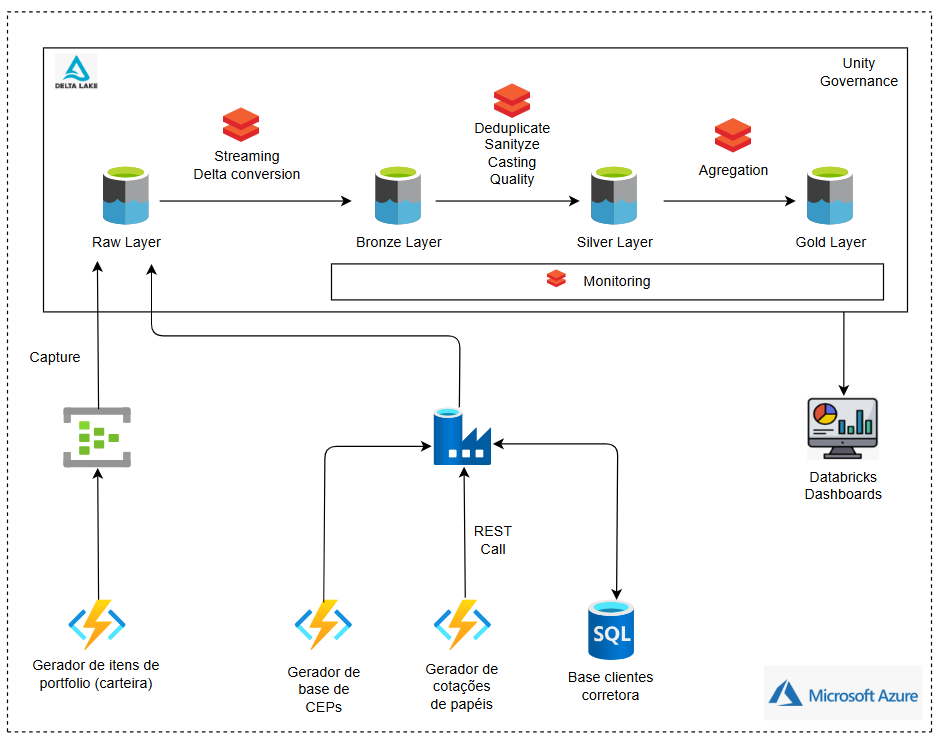

# Case Data Master - Corretora de Valores

## 1. Objetivo

Execução de um projeto de Lakehouse para uma corretora de valores ficticia, realizando a ingestão de dados da bolsa de valores juntamente com uma base de clientes e suas transações realizadas no pregão.  

Este case foi utilizado no processo de obtenção da badge 'Data Master' na [F1rst Tecnologia](https://www.f1rst.com.br/first/#/) uma empresa do grupo [Santander](https://www.santander.com.br/).

## 2. Descrição resumida

O case se baseou no desafio de criar um projeto de Lakehouse completo, passando pela ingestão, processamento e monitoramento.

A solução pedida seria a representada pelo diagrama abaixo:

O projeto visa demonstrar a ingestão de dados das seguintes fontes: 

- Banco de dados relacional: Base cadastral de clientes da corretora

- Mensageria: Logs de transações de compra e venda de papéis da bolsa pelos clientes gerados pelos sistemas da corretora

- REST API: Informações sobre a cotação de papéis da bolsa de valores e base de CEPs dos correios para enriquecimento de informações cadastrais
 

Os dados ingeridos serão disponibilizados no lake através da arquitetura medalhão onde cada uma de suas camadas apresentará as seguintes características: 
 
- Camada Raw: dados brutos e não tratados onde pousarão os dados provenientes das fontes de ingestão

- Camada Bronze: dados ainda no formato bruto, porém estruturados e com caráter histórico.  

- Camada Silver: dados deduplicados, filtrados e tipados, nessa camada também serão aplicadas as regras de qualidade além de tratamento dos campos sensíveis

- Camada Gold: dados agregados formando a composição da situação de cada cliente e sua posição de papéis na bolsa de valores assim como informações cadastrais, as alterações nos dados dessa camada também serão registradas através da geração de tabelas históricas  

Uma camada extra foi definida e chamada de 'mngt' a qual armazenará informações de controle de todo o processo no lake assim como dados cadastrais de governança. 

Além dos processos para movimentação dos dados entre as camadas definidas, foram criados processos para realizar o monitoramento do pipeline. 

## 3. Pré-requisitos

O projeto utiliza recursos disponibilizados pelo provedor de nuvem Microsoft Azure, portanto para a sua implementação serão necessários os seguintes itens:

- [PYTHON 3.11](https://www.python.org/downloads/release/python-3110/)
- [AZURE CLI](https://learn.microsoft.com/en-us/cli/azure/install-azure-cli-windows?pivots=winget)
- [AZURE FUNCTIONS CORE TOOLS](https://learn.microsoft.com/en-us/azure/azure-functions/functions-run-local?tabs=windows%2Cisolated-process%2Cnode-v4%2Cpython-v2%2Chttp-trigger%2Ccontainer-apps&pivots=programming-language-python#install-the-azure-functions-core-tools)
- [DATABRICKS CLI](https://docs.databricks.com/en/dev-tools/cli/install.html#source-install)
- Interpretador Bash (sugestão para ambientes Windows [Git Bash](https://git-scm.com/downloads/win))

**Azure account**

É necessário possuir uma Azure account com subscrição ativa nas modalidades 'Free Tier' ou 'Pay as you go'. 
Ver: [Azure account](https://azure.microsoft.com/en-us/pricing/purchase-options/azure-account)

Os seguintes recursos são provisionados para execução do case:
- Storage Account
- Data Factory
- Function App
- Event Hubs
- SQL Server
- Key Vault
- Databricks

## 4. Configuração

### Login Azure account

No prompt Bash, no diretório raiz do projeto, faça o login na sua Azure account através do comando abaixo, quando solicitado selecione a subscription desejada.

    az login --tenant "<TENANT_ID>"

Obtenha o <TENANT_ID> através do [portal Azure](https://portal.azure.com/#home) -> Tenant Properties

### Estrutura dos scripts de deploy

Os scripts de deploy apresentam a estrutura mostrada abaixo, onde os principais recursos possuem scripts de deploy separados para melhor organização, porém todos são invocados a partir do script principal 'deploy_script.sh' sem necessidade de que sejam invocados separadamente.

### Script de configuração

Edite o arquivo 'config.sh' com os parâmetros necessários para o deploy. 

O arquivo é separado em seções de acordo com o recurso a ser provisionado e possui comentários para guiar no preenchimento de cada parâmetro.

Um parâmetro importante na configuração é o 'DATABRICKS_CREATE_CLUSTER_DEMO', ele define se deve ou não ser criado um cluster Databricks all purpose para realização de queries no lake após a implantação. Caso seja definido como 'false' o cluster não será criado, porém o usuário poderá criar um cluster de forma manual posteriormente. 

**Parâmetros de geração de dados simulados**

No arquivo de configuração na seção 'INTERVALOS DE EXECUÇÂO PIPES ADF E SIMULADORES DE DADOS' são encontrados 4 parâmetros que ditam a frequência em que os dados simulados serão gerados e ingeridos no lake através dos pipelines Data Factory e event hubs. O valor atribuido nesses parâmetros tem impacto direto no custo de execução do case de acordo com as tarifas aplicadas pela Microsoft no uso de cada recurso. 

## 4. Instalação

Uma vez definidos os parâmetros no arquivo 'config.sh', execute o script de deploy.

    ./deploy_script.sh > deploy_output.log 2>&1

No comando acima toda a saída do script de deploy é redirecionada para o arquivo 'deploy_output.log' no diretório raiz do projeto caso deseje consultá-lo após o fim do deploy ou para debug de erros.

Caso queira acompanhar a evolução do provisionamento dos recursos no arquivo de log, execute em um terminal bash separado:

    tail -f deploy_output.log

Aguarde a finalização da execução do script o qual pode levar alguns minutos para ser concluido.

### Checando o deploy

Após a finalização do deploy o projeto entrará no estado de funcionamento normal, para validar se tudo ocorreu bem as seguintes verificações podem ser feitas:

**1. Provisionamento**

  - No portal Azure abra o grupo de recursos definido no arquivo de configuração e verifique se todo os recursos foram provisionados

**2. Ingestão**

  - Abra o Data Factory Studio (Portal Azure -> Data Factory -> Launch Studio) e verifique no menu 'Monitorar' se os pipelines já foram executado ao menos uma vez.

  - Abra o Event Hubs (Portal Azure -> Event Hubs), selecione o namespace configurado e verifique se ao menos um evento foi recebido. 

  - Dependendo dos parâmetros de criação dos dados simulados (ver seção 'INTERVALOS DE EXECUÇÂO PIPES ADF E SIMULADORES DE DADOS' no arquivo de configuração), após alguns minutos o container do storage account configurado deve apresentar no caminho '<CONTAINER_LAKE>/raw' os 4 seguintes diretórios: 'ceps', 'clients', 'orders' e 'stockquotes'.

  - Verifique se foi gerado ao menos um arquivo em cada um dos diretórios citados acima
  
**3. Processamento**

  - Acesse o workspace Databricks provisionado (Portal Azure -> Azure Databricks -> Launch Workspace) e em workflows verifique se o job com nome 'datamaster_workflow' foi criado

  - O job pode levar alguns minutos para entrar no regime de execução até que o cluster seja inicializado, após isso verifique se todas as tasks que formam o job estão em execução

  - Utilizando o cluster de demonstração, ou o cluster criado manualmente, execute o notebook no caminho '<DATABRICKS_WORKSPACE_PROJECT_DIR>/demo/demo' e verifique se todas as tabelas estão sendo populadas

## 5. Finalizando e removendo recursos

Quando desejar encerrar o processamento do case é altamente recomendável que seja feita a exclusão de todos os grupos de recursos criados pelo processo de provisionamento. 

NOTA: alguns grupos de recursos adicionais são criados além do definido nos parâmetros de configuração.

## 6. Desenvolvimento do projeto

### 6.1. A arquitetura

Para implementar a demanda utilizando bases de dados simuladas, a seguinte arquitetura foi implementada:

### 6.2. O script de deploy

Detalhar como foi desenvolvido o script de deploy, detalhes como ordem de provisionamento, configurações especificas como a do SQL no free-tier, criação de regras de firewall, obtenção das managed identity para posterior atribuição de roles como a de 'data contributor' no storage account para a managed identity do data factory, fale como vez para obter atributos retornando em execuções de comandos do azure cli e databricks cli, a criação de tópico evh com capture ativado, a publicação das functions app usando o azure functions core tools e a tentiva que foi feita com GitHub Actions, como invocou uma URL do Azure Fucntion para chamar a functions que faz a contrução do database de clients, o script de implantação do datafactoruy e seus recursos como linked services, data sources, pipelines, etc, detalhe todos os desafios encontrados no deploy do databricks como configuração do Unity e deploy de jobs.

### 6.3. Os dados

Detalhe das 4 fontes de dados usadas

CLIENTS
Principais atributos: <colunas>
Geração: Azure Function App (carga na base SQL)
Meio de disponibilização: SQL Database
Meio de ingestão: Pipeline Data Factory

ORDERS (Carteira)
Principais atributos: <colunas>
Geração: Azure Function App
Meio de disponibilização: Postagem Event Hubs
Meio de ingestão: Event Hubs Capture

STOCKQUOTES (Valor ações)
Principais atributos: <colunas>
Geração: Azure Function App
Meio de disponibilização: REST Endpoint
Meio de ingestão: Pipeline Data Factory

CEPS
Principais atributos: <colunas>
Geração: Azure Function App
Meio de disponibilização: REST Endpoint
Meio de ingestão: Pipeline Data Factory

### 6.4. Os principais componentes

Detalhar o porque foi usado cada um dos itens abaixo e como foram usados no contexto do projeto

#### 6.4.1. Azure Functions

#### 6.4.2. Azure Datafactory

#### 6.4.3. Azure SQL Server

#### 6.4.4. Azure Event Hubs

#### 6.4.5. Azure Databricks

### 6.5. Ingesta de dados

Explicar os fluxos de ingestão de cada uma das bases de dados, explicar os pipelines datafacotry, o capture do event hubs, a extração SQL de clients com controle de ingesta incremental, etc.

### 6.6. A arquitetura do Lake

Mostrar o diagrama de relacionamento entre as camadas e as tabelas do lake (medalhão)

### 6.7. Processamento dos dados

Explicar cada camada mostrando as classes que foram criadas para o processamento dos dados, o processo de governança com data quality e PII, controle de retomada de processamento, as características de reutilização de código, as configurações e explicações de como aceleram o processo para incluir novas tabelas no pipeline, ressaltar: data quality, PII, histórico com time travel, monitoramentos, camadas bronze e silver e gold hist altamentente configuráveis, controle de retomada. 

### 6.8. Monitoramento

Falar sobre os dois monitores implementados e quais podem ser implementados como melhoria, comentar sobre o sistema de alertas (atualmente apenas em tabela).

## 7. Backlog (melhorias)

- Deploy de recursos azure utilizando ARM templates
- Utilização de service principal para execução de jobs Databricks
- Substituir uso do comando grep pelo programa linux 'jq' no tratamento de retornos json nos scripts de implantação
- Substituir uso do Databricks CLI pela API Rest
- Substituir uso de Capture nos event hubs por job databricks lendo diretamente o tópico de ingestão dos status das ordens de compra e venda do cliente
  o Capture é responsável pelo maior custo no namespace
- Usar variáveis globais no data factory e definir seus valores usando azure cli, substituir pelo processo atual que usa awk e json templates para definir parâmetros para os elementos adf.